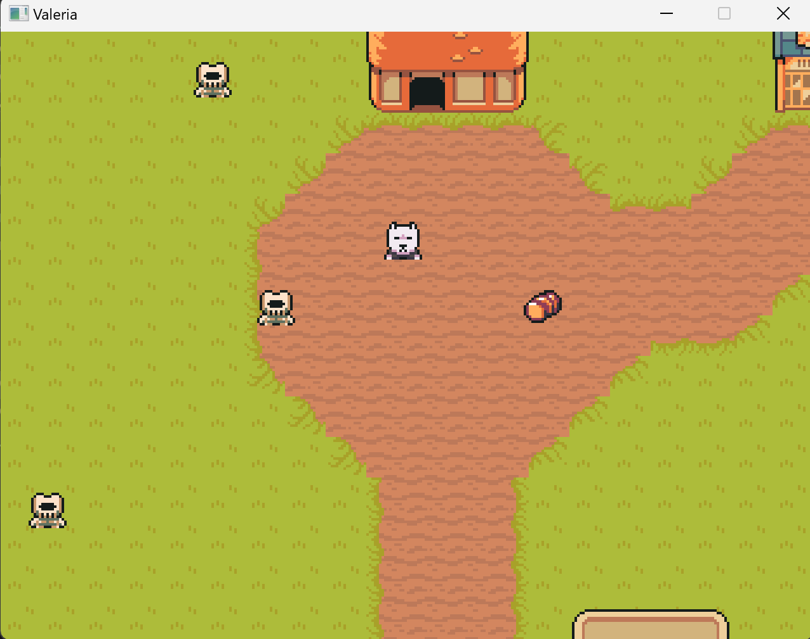

# Multiplayer RPG Game Project Overview

The game is a multiplayer Role-Playing Game (RPG) that allows players to interact in a shared virtual world. The game features real-time gameplay, persistent character progression, and a rich, interactive environment.

## Architecture

The game uses a client-server model with the server authoritative over game state. The server is built with Go and uses EbitEngine for game logic and rendering. The client is built with Excalibur.js and uses WebSockets for real-time communication with the server. The server stores game data persistently using LevelDB.

The game architecture is designed for scalability and performance, with a focus on efficient networking and state synchronization between the client and server.

### Client-Server Architecture

The client and server communicate using WebSockets and gRPC. The server is responsible for managing game state and sending updates to connected clients. The client is responsible for rendering the game world and sending user input to the server.

### State Synchronization

The game uses a combination of WebSockets and gRPC to efficiently synchronize game state between the client and server. The server sends periodic updates to connected clients, which then render the updated game state.

### Latency Compensation

The game uses various techniques to compensate for network latency, such as client-side prediction and interpolation.

## Features

The game features a rich, interactive environment, including:

* Multiplayer interaction: players can see and interact with each other in real-time
* Character progression: players can create and develop their characters over time
* Persistent world: the game state persists between play sessions, stored securely using LevelDB
* Real-time combat: players can engage in combat with enemies or other players, with actions resolved in real-time
* Quest system: a system for creating, assigning, and completing quests to drive the game narrative and player progression
* Inventory management: players can collect, use, trade, or sell items within the game
* Chat system: a real-time chat feature for player communication
* NPC interaction: non-player characters (NPCs) that players can interact with for quests, trading, or narrative purposes
* World exploration: a rich game world that players can explore, possibly with different zones or regions

## Technical Aspects

The game uses a combination of Go and Excalibur.js to build the client and server. The server uses EbitEngine for game logic and rendering, and stores game data persistently using LevelDB.

The game uses a client-server architecture, with the server authoritative over game state. The client and server communicate using WebSockets and gRPC.

The game is designed for scalability and performance, with a focus on efficient networking and state synchronization between the client and server.

## Development Challenges

The game faces several development challenges, including:

* Networking: implementing efficient, real-time networking for a smooth multiplayer experience
* Game logic: creating engaging RPG mechanics that work well in a multiplayer environment
* Performance: optimizing both client and server performance to handle complex game systems with multiple players
* Scalability: designing systems that can scale as the player base grows
* Consistency: ensuring game state remains consistent across all connected clients
* Content creation: developing enough content (quests, items, areas) to keep players engaged

This multiplayer RPG game project combines elements of real-time action, persistent world-building, and social interaction, all built on a modern tech stack designed for performance and scalability.
